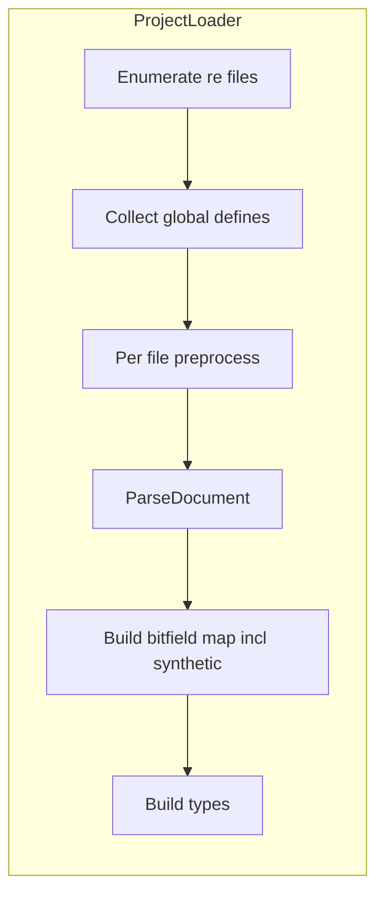

# План: inline bitfield, глобальный препроцессор, декораторы функций

## Контекст (как сейчас)

- Top-level bitfield: [`ParseBitfieldTopLevel`](src/Reac/Dsl/ReDocumentParser.cs) + [`ParseBitfieldInnerLines`](src/Reac/Dsl/ReDocumentParser.cs) — строки битов сейчас только `^(\d+)\s+(\w+)$` без кавычек (стр. 338–347).
- Поля с именованным bitfield: [`ProjectLoader.ToType`](src/Reac/Ir/ProjectLoader.cs) по `TypeExpr.Named` ищет в `bitfieldMap`, выставляет `FlagBits` и `BitfieldTypeName`.
- Функции: [`ReBodyLine.FunctionLine`](src/Reac/Dsl/ReAst.cs) без декораторов; [`FunctionDecl`](src/Reac/Ir/EntityModels.cs) — только адрес/имя/параметры/возврат/заметка.
- Файлы `.re` грузятся в фиксированном порядке: [`EnumerateReFilesSorted`](src/Reac/Ir/ProjectLoader.cs).

---

## 1. Inline-битовые поля

**Синтаксис (как в вашем примере):**

```text
0x16D objectFlags1 : bitfield : byte {
  source "..."
  summary "..."
  0 bIsPickupObject "optional description"
  ...
}
```

- После первого `:` ключевое слово **`bitfield`**, второй **`:`** — storage (`byte`, …), затем блок `{ ... }`.
- Тело блока — **тот же набор правил**, что у top-level bitfield (`source` / `summary` / `note` / строки битов).

**Парсер**

- В [`ParseTypeBodyLines`](src/Reac/Dsl/ReDocumentParser.cs) однострочная модель не подходит: нужно **смещение по строкам с индексом в `body`** или отдельная функция «прочитать поле», которая:
  - распознаёт префикс `0x… name : bitfield : storage {`;
  - вызывает существующий [`ParseBlock`](src/Reac/Dsl/ReDocumentParser.cs) от `{` и передаёт внутреннюю строку в общий разбор (рефактор: вынести общую логику из `ParseBitfieldInnerLines` в метод, принимающий `body` блока).
- Новая ветка AST: например `ReBodyLine.InlineBitfieldFieldLine` с полями: offset, имя поля, storage, список битов, source/summary/note (зеркало [`BitfieldDef`](src/Reac/Dsl/ReAst.cs) без глобального имени типа).

**Описания битов в кавычках**

- Расширить разбор строк битов (и для top-level, и для inline): после имени бита — опционально строковый литерал (по аналогии с enum в [`ParseEnumInnerLines`](src/Reac/Dsl/ReDocumentParser.cs)).
- IR: добавить в [`FlagBitDecl`](src/Reac/Ir/EntityModels.cs) опциональное `Description` (или отдельный тип строки бита), обновить [`ToBitfieldDecl`](src/Reac/Ir/ProjectLoader.cs), шаблоны [`field_note.scriban`](src/Reac/Export/Templates/field_note.scriban) / [`FlagBitVm`](src/Reac/Export/HtmlExportModels.cs) при необходимости.

**Загрузка в IR**

- Для `InlineBitfieldFieldLine` в `ToType`:
  - сгенерировать **синтетическое** имя типа bitfield, например `ParentTypeName_fieldName` (правила экранирования при коллизиях — зафиксировать и проверять в [`ProjectValidator`](src/Reac/Validate/ProjectValidator.cs)).
  - собрать [`BitfieldTypeDecl`](src/Reac/Ir/EntityModels.cs) (тот же путь, что [`ToBitfieldDecl`](src/Reac/Ir/ProjectLoader.cs)) и **зарегистрировать** в общем списке bitfield-типов вместе с top-level.
  - поле [`FieldDecl`](src/Reac/Ir/EntityModels.cs): scalar storage, `FlagBits`, `BitfieldTypeName` = синтетическое имя — тогда существующий HTML ([`FieldTypeHtml`](src/Reac/Export/HtmlExporter.cs)) продолжит вести на страницу bitfield.

**Порядок в `ProjectLoader`**

- Либо двухпроходно: сначала собрать все `BitfieldDef` + синтетические inline из всех типов, затем строить `TypeDecl`; либо при обходе типов добавлять в общий `bitfieldMap` до разрешения ссылок — важно не сломать разрешение `Named` на bitfield.

---

## 2. Глобальный препроцессор (`#define`, `#ifdef`, …)

**Выбор (по ответу): глобально по проекту.**

**Фазы (рекомендуемый минимум)**

1. **Сбор макросов:** один проход по всем `.re` (в том же порядке, что [`EnumerateReFilesSorted`](src/Reac/Ir/ProjectLoader.cs)): извлечь строки `#define NAME …` (остаток строки — «сырое» значение до конца строки или упрощённо только один токен — зафиксировать в спеке).
2. **Правила коллизий:** при повторном `#define` одного имени — либо последний выигрывает, либо ошибка (предпочтительно **ошибка валидации**, чтобы не ломать молча).
3. **Условная компиляция:** для каждого файла (или для объединённого текста — лучше **per-file**, чтобы `#ifdef` не «перепрыгивал» файлы) применить `#ifdef` / `#ifndef` / `#else` / `#endif` с множеством **определённых** имён из глобальной таблицы. Вложенность `#if`-дерева — стек.
4. **Подстановка:** после удаления ложных веток — простая замена идентификаторов `NAME` на значение макроса в оставшемся тексте (ограничить только целыми словами / границами токена, чтобы не портить `CObject`).

**Интеграция**

- Новый модуль, например `src/Reac/Dsl/RePreprocessor.cs`, вызывать из [`ProjectLoader.Load`](src/Reac/Ir/ProjectLoader.cs) **перед** `ReDocumentParser.ParseDocument` для каждого файла: вход — сырой текст + глобальный `DefineTable`; выход — текст без директив и с подстановками.
- Директивы: только в начале строки (после пробелов), как в классическом C preprocessor.

**Ограничения v1 (явно задокументировать)**

- Без `#include`, без функциональных макросов с `()`, без `##`.
- При необходимости позже: встроенные макросы (`__FILE__`) — опционально.

---

## 3. Декораторы функций `@name`

**Синтаксис**

```text
@stdcall
@nothrow
0x00451550 Process(): int
```

- Одна или несколько строк подряд: `^\s*@([A-Za-z_][A-Za-z0-9_]*)\s*$`.
- Применяются к **следующей** строке, распознанной как нативная функция ([`TryParseFunctionLine`](src/Reac/Dsl/ReDocumentParser.cs)).

**AST / IR**

- [`ReBodyLine.FunctionLine`](src/Reac/Dsl/ReAst.cs): добавить `IReadOnlyList<string> Decorators` (пустой список по умолчанию для совместимости).
- [`FunctionDecl`](src/Reac/Ir/EntityModels.cs): то же поле.
- [`ProjectLoader`](src/Reac/Ir/ProjectLoader.cs): копировать при сборке `FunctionDecl`.

**Парсер**

- В [`ParseTypeBodyLines`](src/Reac/Dsl/ReDocumentParser.cs): локальный список «ожидающих» декораторов; строка `@foo` добавляет в стек; строка-функция поглощает стек и очищает; любая другая непустая строка (кроме комментария) — сброс ожидающих декораторов (чтобы `@x` не цеплялся к полю ниже).

**Экспорт**

- [`HtmlExporter`](src/Reac/Export/HtmlExporter.cs) — секция нативных функций: вывести декораторы рядом с именем (бейджи или отдельная колонка в [`NativeFnRowVm`](src/Reac/Export/HtmlExportModels.cs) / шаблоне).

**Семантика**

- v1: **только данные**; реестр «что значит `stdcall`» для codegen — позже (отдельный слой или конфиг).

---

## 4. Тесты

- Парсер: inline bitfield внутри `class`/`struct`, коллизия имён, бит с кавычками.
- Препроцессор: `#ifdef` с define из другого файла (порядок файлов), вложенность, неопределённый идентификатор.
- Декораторы: несколько `@`, сброс при вставке поля между декоратором и функцией.

---

## Зависимости и риски



- **Порядок:** глобальные `#define` должны быть собраны до препроцессинга любого файла; при этом `#define` внутри отброшенного `#if 0` **не** должен попадать в таблицу — значит сбор define и вырезание `#ifdef` **нельзя** разнести на два независимых полных прохода без уточнения. Практичный вариант: **двухфазно в одном файле** — сначала применить только условную компиляцию с **пустым** набором define (или только заранее известными), затем собирать define из результата… Это быстро становится муторным.

**Уточнение для реализации:** надёжная модель для «global defines + ifdef»:

- **Вариант A:** в каждом файле сначала удаляются только `#ifdef` ветки, используя **уже накопленный** глобальный словарь из *предыдущих* файлов (по алфавиту); `#define` в текущем файле добавляются в словарь после обработки файла. Тогда define из `z.re` не виден в `a.re` — **не полностью глобально**.

- **Вариант B (настоящий global):** проход 1 — во всех файлах собрать только `#define` (игнорируя `#ifdef` или обрабатывая их с пустым набором — спорно). Проход 2 — с полным словарём применить `#ifdef` и подстановки к каждому файлу.

Зафиксировать в реализации **вариант B** для `#define`: сначала полный сбор `#define` из всех файлов (строки `#define` можно извлекать regex-ом даже из «мертвых» веток, если пользователь ожидает, что они всё равно задают макрос — обычно в C мёртвые ветки не парсят для define). Стандарт C: директивы внутри false branch **не** сканируются для define. Значит порядок: **сначала** рекурсивно развернуть `#ifdef` в каждом файле с **начальным** пустым или конфигурируемым набором predefined, **потом** собирать define из результата — но тогда define внутри `#ifdef VC` не попадут, пока `VC` не задан извне.

Практичный компромисс для KB: **предопределённые символы** в `project.toml` / target (`VC`, `PS2`, …) + глобальные `#define` из **всех** файлов, собранные **после** одного прохода условной компиляции с предсимволами. Это нужно явно описать в плане как открытый момент при реализации.

В план занести: «уточнить при реализации: predefined symbols из target/config + порядок сбора define vs ifdef».

---

## Файлы для правок (ориентир)

| Область | Файлы |
|--------|--------|
| Inline bitfield + биты с описаниями | [`ReDocumentParser.cs`](src/Reac/Dsl/ReDocumentParser.cs), [`ReAst.cs`](src/Reac/Dsl/ReAst.cs), [`ProjectLoader.cs`](src/Reac/Ir/ProjectLoader.cs), [`EntityModels.cs`](src/Reac/Ir/EntityModels.cs), шаблоны field note |
| Препроцессор | новый `RePreprocessor.cs`, [`ProjectLoader.cs`](src/Reac/Ir/ProjectLoader.cs) |
| Декораторы | [`ReDocumentParser.cs`](src/Reac/Dsl/ReDocumentParser.cs), [`ReAst.cs`](src/Reac/Dsl/ReAst.cs), [`EntityModels.cs`](src/Reac/Ir/EntityModels.cs), [`HtmlExporter.cs`](src/Reac/Export/HtmlExporter.cs), scriban для native fn |
| Тесты | [`tests/Reac.Tests`](tests/Reac.Tests) |
