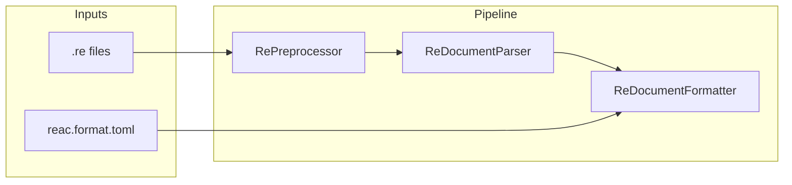

# Форматтер `.re` с конфигом (отступы + hex + поля)

## Контекст

- Язык DSL парсится в AST: [`ReTopLevel` / `ReBodyLine`](e:\.dev\.vibecoding\reknow-dda\src\Reac\Dsl\ReAst.cs), типы — [`TypeExpr`](e:\.dev\.vibecoding\reknow-dda\src\Reac\Ir\TypeExpr.cs). Печати AST в исходник пока нет (есть только локальный `TypeString` в [`HtmlExporter`](e:\.dev\.vibecoding\reknow-dda\src\Reac\Export\HtmlExporter.cs) — его логику стоит вынести в общий хелпер, например `Dsl/TypeExprFormatter.cs`, чтобы не дублировать).
- Парсер **игнорирует** строки, состоящие только из `//` комментариев ([`ParseTypeBodyLines`](e:\.dev\.vibecoding\reknow-dda\src\Reac\Dsl\ReDocumentParser.cs) и аналоги для bitfield/enum). Значит **round-trip parse → format удалит такие комментарии**. Это нужно явно задокументировать в help/README только если решите добавлять доку; в коде достаточно XML-комментария у команды `format`.

## Конфиг (отдельный файл)

- Имя по умолчанию: **`reac.format.toml`** в корне проекта (рядом с `project.toml`, тот же `--project` / поиск вверх по дереву, что уже делает [`ResolveRoot`](e:\.dev\.vibecoding\reknow-dda\src\Reac\Program.cs)).
- Опционально: флаг `--format-config <path>` для явного пути.
- Если файла нет — дефолты: **пробелы, ширина 2** (как у [`.csharpierrc.yaml`](e:\.dev\.vibecoding\reknow-dda\.csharpierrc.yaml) / [`.editorconfig`](e:\.dev\.vibecoding\reknow-dda\.editorconfig) для C#).

Пример содержимого:

```toml
[indent]
style = "space"   # "space" | "tab"
width = 2         # 2 | 4 (для style=space — столько символов на уровень; для tab — один \t на уровень, width можно игнорировать или зарезервировать под будущее)

[hex]
digits_case = "upper"   # "upper" | "lower" — регистр шестнадцатеричных цифр после префикса 0x
pad_offsets = 3         # минимальное число hex-цифр после 0x для смещений полей экземпляра и inline bitfield offset
pad_sizes = 3           # то же для `size 0x...` в заголовке class/struct
pad_addresses = 8       # то же для абсолютных адресов: static-поля, native-функции (0x... перед именем)

[fields]
align_types = false     # true: выровнять колонку `:` у строк полей экземпляра по самому длинному имени в этом теле
```

Валидация: `style` и `width` (только `2` или `4` для space; для tab — допускать только `style=tab`, width опционален/игнорируется). Для `[hex]`: `digits_case` — только `upper`/`lower`; `pad_*` — целые >= 1 (верхняя граница по желанию, например 16).

**Семантика pad_*:** значение — минимальное количество **цифр после `0x`**; при необходимости слева дополняем нулями; если числу нужно больше цифр, выводим все значащие (ширина не режется). Примеры при `upper` и `pad_offsets = 3`: `0x010`, `0xABC`; при `pad_addresses = 8`: `0x00123456`.

**Где что применять:** `pad_offsets` — offset в строках полей (`0x... name : type`), заголовок inline bitfield (`0x... name : bitfield : Storage {`). `pad_sizes` — только литерал в `size 0x...` после `size`. `pad_addresses` — `static 0x...` и адрес у `FunctionLine` (`0x... name(...)` / `fn` / `static`). Строки enum (`число name`) и bitfield (`число name`) по умолчанию используют **тот же** `pad_offsets` (как «короткие» целые в колонке); при необходимости позже можно вынести отдельные ключи.

**`[fields].align_types`:** при **`false`** (дефолт) между именем и двоеточием один пробел, как обычно: `0x354 health : float`. При **`true`** внутри одного тела (`module { ... }`, `class`/`struct { ... }`) для всех строк **`FieldLine`** (поля экземпляра `0xOFFSET name : type`) вычисляется `max = max(длина имени)` по **UTF-16 кодовым единицам** (как `string.Length` в .NET), затем каждое имя дополняется пробелами справа до ширины `max`, затем **` : `** (пробел, двоеточие, пробел) и тип. Пример:

```text
0x354 health  : float
0x408 weapons : CWeapon[10]
0x5F4 wanted  : CWanted*
```

Участвуют только `FieldLine` данного тела; `StaticFieldLine`, `FunctionLine`, `InlineBitfieldFieldLine`, `note`/`summary`/прочее в расчёт ширины не входят (их строки не выравниваются этим правилом в v1). Декораторы `@` перед полем: выравнивание считается только по строкам `FieldLine`; декораторы печатаются как есть над полем, ширина колонки по-прежнему от всех имён `FieldLine` в теле.

Загрузка: Tomlyn (уже в [`ProjectMeta.Load`](e:\.dev\.vibecoding\reknow-dda\src\Reac\ProjectMeta.cs)) — новый статический класс, например `FormatConfigLoader`, возвращающий `FormatOptions`: отступ, hex и флаг `AlignFieldTypes`. Дефолты при отсутствии файла/секции: согласовать с текущим стилем репозитория (например `lower` + умеренный pad) или явно задать в коде те же значения, что в примере выше — зафиксировать в `FormatConfigLoader`.

## Ядро форматтера

- **Скобки:** открывающая `{` **всегда на той же строке**, что и заголовок блока (K&R-стиль), без переноса `{` на новую строку. Примеры канона: `target id {`, `module Name {`, `struct Foo : Bar size 0x100 {`, `bitfield X : uint32 {`, `enum E : uint8 {`, а также заголовок inline bitfield у поля `0x10 flags : bitfield : Storage {`. Закрывающая `}` — отдельной строкой с отступом уровня блока.
- Новый модуль, например `Dsl/ReDocumentFormatter.cs`:
  - Вход: `IReadOnlyList<ReTopLevel>`, `FormatOptions` (hex + `align_types`).
  - Выход: одна строка с `\n` (и при необходимости нормализация конца строки — можно зафиксировать LF как в остальном проекте).
  - Для каждого уровня вложенности `{ ... }` добавлять один «unit» отступа (таб или N пробелов).
  - Покрыть все варианты AST: `target`, `module`, `class`/`struct`, `bitfield`, `enum`, все ветви `ReBodyLine` (включая `InlineBitfieldFieldLine`, `FunctionLine` с декораторами, `StaticFieldLine`, строки `note`/`summary`/`source` и т.д.).
  - Строковые литералы при выводе: обратное экранирование в `"..."` (добавить небольшой `EscapeReString` рядом с [`StringLiterals`](e:\.dev\.vibecoding\reknow-dda\src\Reac\Dsl\StringLiterals.cs) или внутри форматтера).
  - Числа: общий хелпер `FormatHex(value, HexKind)` где `HexKind` различает offset / size / address / enum_or_bit_index — выбирает `pad_*` и `digits_case` из конфига; префикс всегда `0x`.
  - Поля: при печати тела модуля/типа сначала (или в том же проходе) вычислить `maxNameWidth` для `FieldLine`, затем для каждой такой строки `PadRight(name, maxNameWidth)` перед ` : `, если `align_types`; иначе один пробел перед `:`.

## CLI

- В [`Program.cs`](e:\.dev\.vibecoding\reknow-dda\src\Reac\Program.cs): команда `format` с `--project`, опционально `--check` (exit code ≠ 0, если отличается от текущего файла), по умолчанию перезапись файлов.
- Источник файлов: те же каталоги, что [`ProjectLoader`](e:\.dev\.vibecoding\reknow-dda\src\Reac\Ir\ProjectLoader.cs) (`targets_dir`, `modules_dir`, `types_dir`) — без `docs` (там `.rdoc`, другой парсер). При необходимости позже расширить.
- Поток: для каждого `.re` — прочитать текст → `RePreprocessor.ProcessAllFiles` / один файл через тот же pipeline, что при загрузке проекта (согласовать с тем, как [`ProjectLoader`](e:\.dev\.vibecoding\reknow-dda\src\Reac\Ir\ProjectLoader.cs) применяет препроцессор), затем `ParseDocument` → `ReDocumentFormatter.Format` → сравнение или запись.

Уточнение по препроцессору: форматировать **уже после** препроцессинга — иначе условные блоки не совпадут с тем, что реально парсится. Это важно зафиксировать в реализации.

## Тесты

- Проект тестов (если есть — подключить; иначе `src/Reac.Tests` или существующий test-проект): снапшот-тесты на короткий фрагмент `.re` с разными конфигами (отступы; отдельно — `digits_case` и нулевой паддинг до нужной ширины).

## CI (опционально)

- В [`.github/workflows/ci.yml`](e:\.dev\.vibecoding\reknow-dda\.github\workflows\ci.yml) можно добавить шаг `dotnet run --project src/Reac -- format --check` после validate, чтобы репозиторий оставался отформатированным — только если готовы сразу прогнать `format` по всему `re/` и закоммитить.


