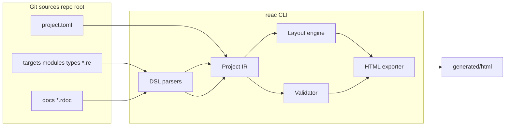

# Reverse Engineering as Code — MVP (GTA VC)

## Контекст

Рабочая директория пуста: реализуем всё с нуля по вашему порядку приоритетов. Стек: **.NET 8+ (C#)**, **System.CommandLine** для CLI, **records / immutable types** (или POCO) для IR, **парсеры `.re` и `.rdoc` — на [Sprache](https://github.com/sprache/Sprache)** (комбинаторный парсер; отдельные грамматики/модули для каждого DSL, общие примитивы — идентификаторы, строки, hex), шаблоны HTML — **Scriban** или **Fluid** (статический вывод без Razor runtime), тесты — **xUnit** или **NUnit**, импортёр — **`HttpClient`** + **AngleSharp** (или **HtmlAgilityPack**) для HTML.

**TOML:** библиотека **Tomlyn** для чтения `project.toml`.

Почему C#: единый стек с tooling на Windows, нормальная типизация IR, удобный CLI через `dotnet run` / global tool; Docker на **`mcr.microsoft.com/dotnet/sdk`** воспроизводит среду без «зоопарка» Python на хосте.

## Единый корень knowledge base (обязательно)

- **`project.toml` лежит в корне репозитория** (рядом с **`Reac.sln`** / **`src/Reac/Reac.csproj`**).
- Рядом с ним — каталоги **`targets/`**, **`modules/`**, **`types/`**, **`docs/`**, **`generated/`** (без вложенной папки `project/` как корня KB).
- Опционально: `binaries/` для путей к `.exe` в meta; код CLI и импортёра — в **`src/Reac/`** (например `Importers/GtaModsVc/`), не путаем с данными KB.

## Предлагаемая структура репозитория

```
reknow-dda/
  Reac.sln
  project.toml                # KB meta: roots, target id, binary metadata
  README.md
  targets/
    gta_vc_1_0_win32.re
  modules/
    RenderWare.Core.re
    GTA.Core.re
  types/
    CVector.re
    CMatrix.re
    CEntity.re
    CPhysical.re
    CPed.re
  docs/
    Overview.rdoc
    GTA_VC_Memory_Model.rdoc
  binaries/                   # опционально
  generated/
    html/                     # в .gitignore; derived output
  src/
    Reac/
      Reac.csproj             # OutputType Exe или консольный tool
      Program.cs              # System.CommandLine root
      ProjectMeta.cs          # Tomlyn load project.toml
      Dsl/
      Ir/
      Layout/
      Validate/
      Export/
        Templates/            # .scriban / embedded resources
      Importers/GtaModsVc/
  tests/
    Reac.Tests/
      Reac.Tests.csproj
      fixtures/
        gtamods_vc_memory_addresses.html
      ParseReTests.cs
      ...
```

`reac init` (подкоманда CLI) создаёт этот каркас в указанной директории, с примерами `.re`/`.rdoc` и `project.toml` в **корне** целевого дерева. Запуск: **`dotnet run --project src/Reac`** или **`docker compose run … dotnet test`**.

## Слой 1: `project.toml` и meta

- Поля минимум: `name`, `version`, активный `target` (id), при необходимости явные пути к `targets_dir`, `modules_dir`, `types_dir`, `docs_dir`, `generated_dir` (дефолты — имена каталогов выше).
- Секция бинаря: `path`, `sha256` (опционально), `game`, `version`, `platform`, `image_base` (опционально), `source_urls`.
- **`pointer_size_bytes`** (или эквивалент в секции активного **target** в `targets/<id>.re` / в `project.toml`): явный размер указателя для данной платформы. Для **`gta_vc_1_0_win32`** — **`4`**. Layout-движок и вычисление span для `pointer` и `PointerType` используют **только** это значение из meta активного target, **без** неявного хардкода `4` в коде как молчаливого дефолта всего CLI (дефолт допустим только как fallback, если поле задано в `project.toml` для репо-примеров, с документированием).

Парсинг **project.toml**: **Tomlyn** (`Toml.Parse` → модель или свой класс), путь — **корень репозитория / cwd** для команд CLI.

## Минимальный типовой AST полей (обязательно)

Парсер `.re` приводит текст типа поля к **дереву**, не к одной строке:

- **`ScalarType`**: `pointer`, `uint8`/`byte`, `uint16`, `uint32`, `uint64`, `int32`, `float`, `double` и т.д. Для **`pointer`** размер в байтах для layout/span **не** вшит в парсер: берётся из **`pointer_size_bytes`** активного target (см. meta).
- **`NamedType`**: имя сущности (`CMatrix`, `CEntity`, …).
- **`PointerType`**: указывает на вложенный `TypeExpr` (часто `NamedType` или `ScalarType`); размер значения указателя = **`pointer_size_bytes`** target.
- **`ArrayType`**: `element: TypeExpr`, `length: int` (например `CWeapon[10]` → `ArrayType(NamedType("CWeapon"), 10)`).

В IR у `Field` хранится **`type_expr: TypeExpr`** (или сериализуемое представление этого AST). Отдельно — флаги/маркеры резолва имён при валидации.

## DSL v0.1 — синтаксис `.re`

**Реализация парсера:** пакет **Sprache** (`Sprache.Parse.*`), по возможности вынести общие правила (пробелы, комментарии `//`, строки, hex) в общий модуль для `.re` и `.rdoc`.

Лексика: идентификаторы `CName`, hex offset `0xNNN`, строки `"..."`, многострочные `"""..."""`, комментарии `//` до конца строки.

**Top-level:**

- `target <id> { ... }` — внутри, помимо полей из ТЗ: **`pointer_size_bytes <int>`** (для VC Win32 пример: **`4`**), чтобы размер `pointer` был явным в тексте и попадал в IR активного target.
- `module <dotted.name> { ... }`
- `class <Name> [: <Parent>]? size <hex> { ... }`
- `struct <Name> [: <Parent>]? size <hex> { ... }`

**Инвариант:** в MVP **не может** существовать двух сущностей `class`/`struct` с одним и тем же **именем** в разных файлах — **глобальная уникальность имён типов**.

**Внутри блока class/struct/target/module:**

- `module <dotted.name>`
- `source "url"` (и при необходимости сочетается с provenance из импортера — см. ниже)
- **`summary """..."""` или `summary "..."` на уровне сущности** (class/struct/module)
- **`note """..."""` на уровне сущности** (опционально)
- Поля: строка вида `<offset> <name> : <type_syntax>` плюс опционально **`note "..."` / `note """..."""` для поля** (отдельной строкой после поля или inline — зафиксировать один канонический вариант в грамматике)

**Синтаксис типа в поле (текст → TypeExpr):**

- Скаляры и `pointer` → `ScalarType`
- Идентификатор → `NamedType`
- Суффикс `*` / префикс `*` (выбрать один стиль в грамматике) → `PointerType`
- `[N]` → `ArrayType`

**Расширяемость:** `global`, `function`, `enum`, … — вне MVP или явная ошибка «not implemented».

## DSL v0.1 — синтаксис `.rdoc`

Парсер — тоже **Sprache** (отдельная цепочка правил от `.re`).

- `document <Id> {`
- `title "..."` 
- **`references { ref EntityName ... }`** — **универсальная ссылка** `ref <Name>` без разделения на `class_ref` / `struct_ref`; резолв по имени в едином реестре типов (class/struct). **Инвариант MVP:** имена **class/struct глобально уникальны по всему проекту** — дубликат имени типа в разных файлах = **ошибка** валидации (отдельно от `ref`).
- `summary """ ... """`
- `section <Name> { text """ ... """ }`
- `}`

Валидация: каждый `ref` должен указывать на существующую сущность в IR (тип с данным именем).

## Provenance в IR (обязательно)

Для сущностей и/или полей (минимум для импортированных и рекомендуется для всех источников), поля provenance:

- `SourceUrl: string?`
- `SourceSection: string?` (например заголовок секции вики: `CEntity`)
- `ImportedBy: string?` (например `gtamods-vc`)
- `ImportedAt: DateTimeOffset?` (UTC при записи файла импортёром)

Ручные правки: `imported_*` могут быть пустыми; импортёр заполняет все четыре при генерации `.re`.

## Внутренний IR (C#)

- `Project`: targets, modules, types, documents, пути файлов.
- `ClassType` / `StructType`: `name`, `kind`, `parent_name`, `size`, `module`, **`summary` / `note`**, **`provenance`**, `fields`, `file_path`.
- `Field`: `offset`, `name`, **`type_expr: TypeExpr`**, опционально **`note`**, `declaring_type_name` (из layout), **`provenance`** если нужно на уровне поля (импорт из вики).
- Резолв имён: отдельный проход; неразрешённый **именованный** тип — не «тихо».

Отдельно **views**: `LayoutResult` с flattened полями, флагами **indeterminate** для полей/типов без известного размера.

## Наследование и layout (обязательные правила)

1. **Offsets в derived class — абсолютные** от начала объекта (как раньше).
2. **Explicit field override в MVP не поддерживается** — нет синтаксиса/семантики «переопределить поле родителя»; конфликты только как ошибки валидации.
3. **Собственные поля derived и граница родителя:** если **parent разрешён** и **`parent.size` известен**, каждое own field должно иметь **`offset >= parent.size`**; нарушение — **ошибка** (модель «наследник только добавляет хвост»).
4. **Инвариант:** если **parent неразрешён** (нет сущности с таким именем) **или** **`parent.size` неизвестен** (unresolved/indeterminate размер базы), проверка **`offset >= parent.size` не выполняется как жёсткая** — помечается **`indeterminate`**, валидатор выдаёт **warning**, а **не** ложный error от сравнения с `0` или пропущенного размера.

Алгоритм:

1. Построить цепочку по `parent` (single inheritance).
2. Flatten: поля родителей + own fields; `declaring_type` для каждого offset.
3. **Overlap:** если для поля известен **строгий** span в байтах — участвует в проверке пересечений; если span **неизвестен** — см. политику ниже.
4. **Duplicate offsets** в списке own fields типа — ошибка.

## Политика unknown / unresolved типов (обязательно)

- **`NamedType`, который не резолвится** в известную сущность с известным `size`: валидатор выдаёт **warning** (не молчит), тип помечается как **unresolved**.
- **Неразрешённый non-pointer тип не получает выдуманного размера** — не подставляем «как будто 4 байта», чтобы не притворяться умными.
- **Layout check для такого поля — `indeterminate`:** глобальные overlap-проверки для этого поля **не проводятся как полные** (или помечаются как неполные); в отчёте/ HTML явно: «layout indeterminate из-за неизвестного размера типа X».
- Указатели/скаляры с фиксированным размером — нормальный строгий span.

MVP-упрощение: `CWeapon`, `CWanted` без определения — **warning + indeterminate**, отображение в HTML в списке **unresolved references**.

## Импорт GTAMods Wiki

### Канон примеров структур (обязательно)

- **Ориентир для размеров, offset’ов полей и текстовых описаний** в scaffold-примерах (`types/*.re`), в README и для **сверки вывода импортёра** — страница **[Memory Addresses (VC)](https://gtamods.com/wiki/Memory_Addresses_%28VC%29)** на GTAMods Wiki.
- Импортёр парсит HTML этой страницы; секции MVP: **CEntity**, **CPhysical**, **CPed**, **CMatrix**, **CVector** (заголовки/якоря как на вики).
- **Расхождения с ранними черновиками спецификации** (в т.ч. упрощённые таблицы из переписки) **не** являются источником истины: при конфликте ориентир — **таблицы на вики** либо осознанная правка в `.re` с `note`/комментарием.
- Зафиксированные на вики **общие размеры** (для проверок и документации): **CEntity** `0x064` bytes; **CPhysical** `0x120` включая CEntity; **CPed** `0x6D8` включая CPhysical и CEntity; **CMatrix** `0x040`; **CVector** `0x00C`. Детальный набор полей (в т.ч. дополнительные строки вроде `0x11A` у CPhysical, полная таблица CPed с множеством байтовых флагов) брать **из таблиц на странице**, а не из укороченных примеров из старых ТЗ.

- **Архитектура:** `fetch` → HTML string; `parse_memory_addresses_vc(html)` → секции; `emit_re_files(repo_root)` → запись под `types/` + provenance в тексте `.re`.
- **Режимы (обязательно):**
  - **Online:** HTTP-загрузка страницы (ручной импорт разработчика); URL по умолчанию — `https://gtamods.com/wiki/Memory_Addresses_%28VC%29` (эквивалентно `Memory_Addresses_(VC)`).
  - **Fixture:** парсинг переданной строки/файла фикстуры **без сети** — используется в **`dotnet test`** и CI (снимок HTML должен отражать структуру этой же страницы).
- **Тесты не ходят в сеть:** только fixture mode и локальные файлы из `tests/fixtures/`.
- В сгенерированных `.re` заполнять **`source`**, **`source_section`**, **`imported_by`**, **`imported_at`** (и при необходимости field-level notes из вики).

Импорт **не** перезаписывает файлы без `--force`.

**Политика канона (см. README):** импортёр **никогда** не становится единственным источником истины — после импорта правки в Git в `.re` первичны.

## Валидатор

**Инварианты MVP (сводка):**

1. Имена **class/struct** — **глобально уникальны** по проекту (см. `.rdoc` / единый реестр типов).
2. Размер **`pointer`** (и raw pointer value) для layout — из **`pointer_size_bytes`** активного target/meta (**`gta_vc_1_0_win32` → 4**), не скрытый магический литерал в коде.
3. Правило **`offset >= parent.size`** для own fields: **error** только при известном родителе и известном `parent.size`; иначе — **warning + indeterminate**, не ложный error.

Проверки: **глобальные дубликаты имён типов**; циклы наследования; несуществующий parent (отдельно от indeterminate-ветки для offset); **нарушение `offset >= parent.size`** при разрешённом parent с известным размером; overlap там, где span известен; дубликаты offset в own fields; **warnings** на unresolved типы, **indeterminate layout** и **indeterminate parent-boundary**; битые `ref` в `.rdoc`.

Выход: код ≠0 при **errors**; **warnings** в stderr (и опционально в отчёте), не глотаются.

## HTML exporter — страница типа/class (обязательный контент)

На странице сущности типа:

- **Inheritance chain** (от корня до текущего типа)
- **Own fields** (только объявленные в этом типе)
- **Flattened fields** (полный layout)
- **Grouped by declaring type** (наследование из CEntity / CPhysical / …)
- **Unresolved references** (список типов/полей, требующих внимания)
- **Provenance** блок: `source_url`, `source_section`, `imported_by`, `imported_at`, путь к файлу `.re`

Плюс общее: индекс, документы, модули, навигация, кликабельные ссылки между страницами и `ref` из `.rdoc`.

## CLI (System.CommandLine)

| Команда | Действие |
|--------|----------|
| `reac init [path]` | Каркас **корня KB**: `project.toml`, `targets/`, `modules/`, `types/`, `docs/`, `generated/`, примеры `.re`/`.rdoc` |
| `reac import gtamods-vc [--url ...] [--fixture path] [--force]` | Online **или** `--fixture` для файла HTML; запись в `types/` + provenance |
| `reac validate` | Загрузка из корня проекта, валидатор + warnings |
| `reac build` | validate + `export html` |
| `reac export html [--out dir]` | по умолчанию `generated/html` |

Точка входа: **`Program.cs`** с `RootCommand` / подкомандами; публикация: **`dotnet publish`** или опционально **`dotnet tool pack`** (global tool `reac`). Локально: **`dotnet run --project src/Reac --`** … args.

## README (обязательные формулировки)

Явно описать:

1. **Source of truth** = `project.toml` + деревья **`types/`**, **`modules/`**, **`targets/`**, **`docs/`** (`*.re`, `*.rdoc`). Всё версионируется в Git как текст.
2. **`generated/html`** (и вообще `generated/`) — **только производный** вывод; не редактировать как источник; в CI пересобирается.
3. **Импортёр GTAMods не является каноническим источником сам по себе** — он лишь **генерирует/обновляет** текстовые файлы; канон после мерджа в репозиторий — **файлы в Git**, правки руками и ревью приоритетны над «повтори импорт».
4. Как запускать тесты и **`reac`** — через **Docker Compose** (команды из раздела Docker в плане), чтобы среда совпадала с CI.

## Docker и Docker Compose (обязательно при разработке)

- **`Dockerfile`** на базе **`mcr.microsoft.com/dotnet/sdk:8.0`** (или актуальный LTS), **`docker-compose.yml`** с сервисом **`reac`**: монтирование репозитория в **`/work`**, `WORKDIR` — корень решения.
- Типовые команды (PowerShell-совместимо):  
  `docker compose run --rm reac dotnet test`  
  `docker compose run --rm reac dotnet run --project src/Reac -- validate`  
  `docker compose run --rm reac dotnet run --project src/Reac -- export html`  
  (или единая точка `dotnet test` с интеграционным тестом, вызывающим экспорт).
- **Разработка и проверка агентом:** агент **сам** гоняет **`docker compose`**, если Docker доступен — не полагаться на случайный `dotnet` на хосте без необходимости.
- **Обязательная проверка HTML:** после экспорта — наличие **`generated/html/index.html`** и страниц сущностей; **smoke-тест** в **xUnit** читает файлы с диска и проверяет подстроки (имя типа, provenance, ссылки).

## CI/CD

- **CI:** образ **`sdk`** — **`dotnet restore`**, **`dotnet build`**, **`dotnet test`** (без сети; импорт только fixture), затем **`dotnet run -- validate`** и **`dotnet run -- export html`**, проверка **`generated/html`**.
- Локально и в CI предпочтительно **docker compose** для единообразия с агентом.
- `.gitignore`: `generated/`, **`bin/`**, **`obj/`**, `.vs/`, `TestResults/`.

## Риски и митигация

- **Вики HTML меняется:** обновление фикстуры и адаптера; онлайн-импорт для локальной проверки.
- **Неразрешённые типы:** не выдумывать размер; indeterminate + warnings — зафиксировано в политике выше.

## Порядок реализации (как вы просили)

1. Skeleton: корневой `project.toml`, каталоги KB, **`Reac.sln`**, **`src/Reac`**, **`tests/Reac.Tests`**, System.CommandLine, Dockerfile/sdk.
2. IR: **TypeExpr AST**, **provenance**, загрузчик многофайлового проекта.
3. Парсер `.re` на **Sprache** (summary/note entity + field).
4. Парсер `.rdoc` на **Sprache** с **`ref Name`**.
5. Layout/наследование (`offset >= parent.size`, indeterminate unknown sizes) + тесты CPed-цепочки.
6. GTAMods: online + fixture, emit `.re`, **`dotnet test`** без сети.
7. Validator (errors + warnings).
8. HTML (полный набор секций на странице типа).
9. README (SoT + generated + импортёр) + **Dockerfile/docker-compose** + добивка тестов.
10. **Прогон в Docker:** **`dotnet test`**, `validate`, **`export html`**, smoke по **`generated/html`**.

## Диаграмма потока данных



Готовность к реализации: план синхронизирован с обязательными уточнениями выше; следующий ш после вашего сигнала — код по чек-листу.
